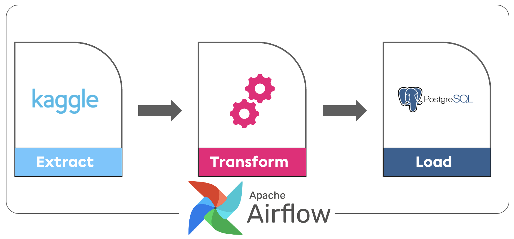

# ETL With Airflow From Kaggle to Postgres



Download a kaggle dataset, set up your postgres environment with docker and load it to Postgres!

### **Database ER Graph**


### **Tools used in the project**

Docker, Kaggle API, Airflow, Pandas, SqlAlchemy, PostgreSQL


---

To use it you need some staffs:

- Kaggle API
- Docker
- Airflow

Learn how to get your own Kaggle API, [**check this**](https://www.oguzerdogan.com/kaggle-api-ve-public-veri-seti-indirme/)

Learn how to install docker, [**check this**](https://docs.docker.com/engine/install/)

Learn how to install airflow, **[check this](https://www.youtube.com/watch?v=YDDMm9M6SFA)**


---

### Requirements

```python
pandas~=1.4.2
sqlalchemy~=1.3.24
airflow
```

---

### Author:

[Oğuz Erdoğan](http://www.oguzerdogan.com)